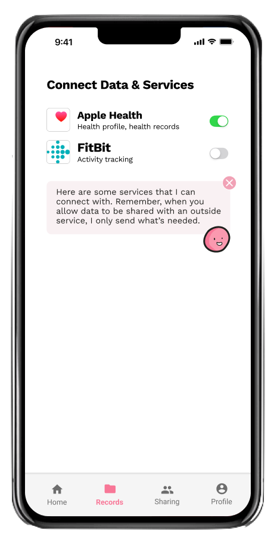

---
# Feel free to add content and custom Front Matter to this file.
# To modify the layout, see https://jekyllrb.com/docs/themes/#overriding-theme-defaults
title: "Rosie"
layout: home
permalink: /
---
<!--- bad, hacky html in md --->
<section class= "chat-container">

     <h2 class='chat-text'>Hi, my name is Rosie!</h2>
</section>

<section class="hero">
     

     <em class="ellipsis-lead">Rosie the Health Manager will...</em> 
     ...put you in the driver’s seat for all of your health and healthcare decisions. 
     <em class="ellipsis-lead">Rosie the Health Manager will...</em> 
     ...help you, your family, and your community to practice effective “primary self care”. 
     <em class="ellipsis-lead">Rosie the Health Manager will...</em> 
     ...make improving and maintaining your health more and more simple for you, your family, and your community.
     

</section>

<!--- actual markdown --->

## How Rosie works

Rosie is built on a few fundamental principles:

- Rosie makes your health record.
- Rosie highlights missing info.
- Rosie asks questions.
- Rosie highlights preventative health care, just for you.
- Rosie learns what health you need.
- Rosie gets better all the time.
- Rosie nudges you to drive your primary self-care.

<section class="screens-container">
     
     
</section>
